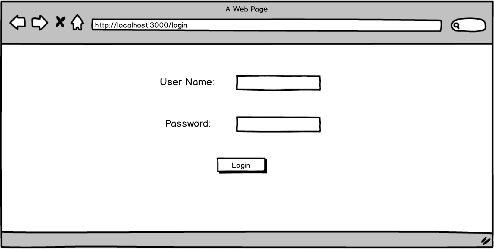
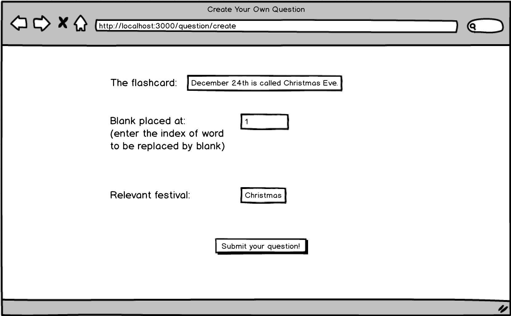
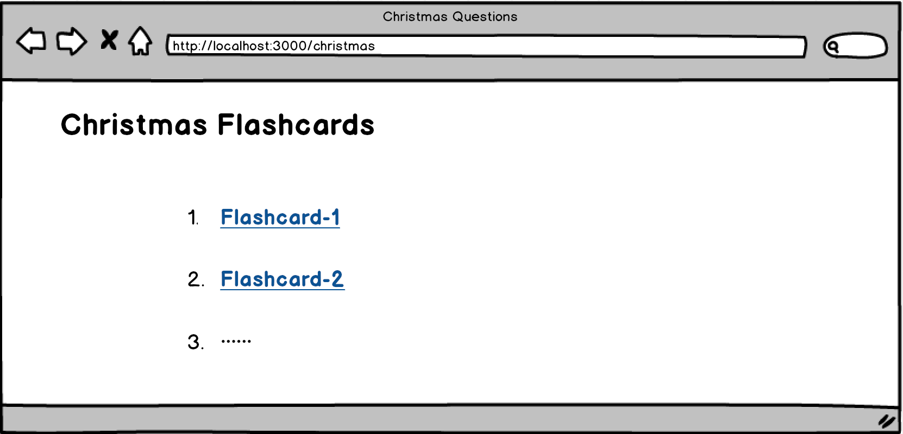
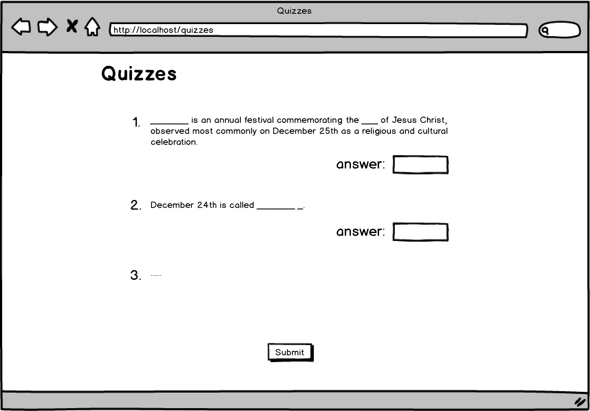
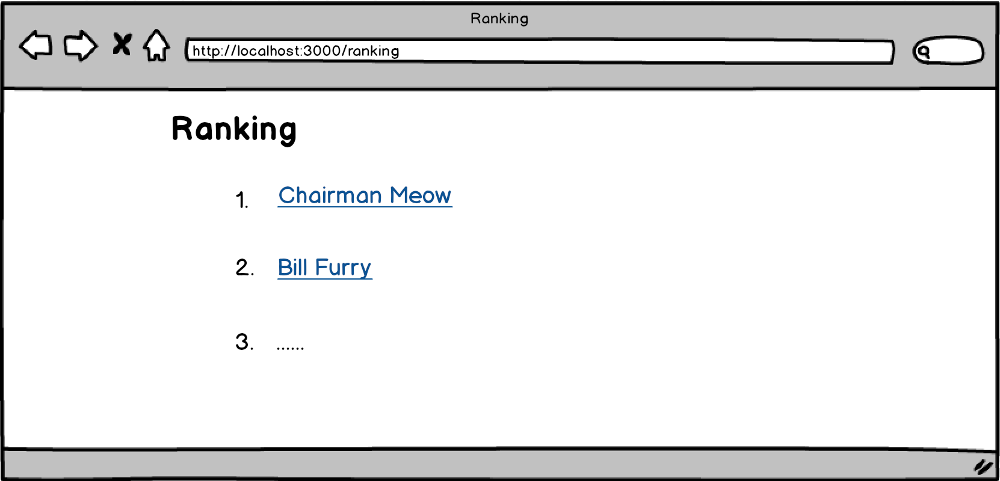
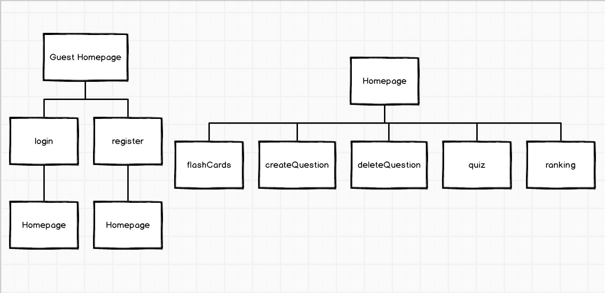

# Festival Chronicle 

## Overview


Festival, as a event combining various aspects from a culture, is the precious gift of thousands of years' civilization. Different cultures brew diverse festivals. Sometimes we to know a new culture through the lens of its festivals. Festival Chronicle is the best navigator for your voyage to the festival kingdom.

Festival Chronicle is a web app that will allow users to learn basic knowledge of different festivals from different cultures. Users can register and login. Once they're logged in, they can create their own questions for other users to study. For every question that they create, they can choose where to be left blank. They can also doing another's questions or just viewing flashcards. Each user has their own stats (quiz scores and number of questions created) shown on the ranking list.


## Data Model


The application will store Users, Festivals, Questions

* users can create multiple questions (via references) which can be modiefied. 
* each festival can have multiple questions (by embedding)
* each user has a stats recording his/her score (by embedding)


An Example User:

```javascript
{
  username: "festivalcitizen",
  hash: // a password hash,
  myQuestions: // an array of references to Question documents this user has created
  stat: { quiz: 17, accuracy: 0.6, ownQuestion: 10 } // the stats of this user, number of quiz took, accuracy and number of questions created
}
```

An Example Festival with Embedded Questions:

```javascript
{
  name: "Christmas", // name of the festival
  questions: [
    { 
        createdBy: // reference to the user object of the user created this question
        flashcard: "Christmas is an annual festival commemorating the birth of Jesus Christ, observed most commonly on December 25th as a religious and cultural celebration.", // flashcard of this question
        blank: [0, 7] // array of indexes of blanks set by the question creater
    },
    { 
        createdBy: // reference to the user object of the user created this question
        flashcard: "December 24th is called Christmas Eve.", // flashcard of this question
        blank: [4, 5] // array of indexes of blanks set by the question creater
    },
  ]
}
```


## [Link to Commented First Draft Schema](db.js) 

(___TODO__: create a first draft of your Schemas in db.js and link to it_)

## Wireframes

(___TODO__: wireframes for all of the pages on your site; they can be as simple as photos of drawings or you can use a tool like Balsamiq, Omnigraffle, etc._)

/login - page for user to login



/create question - page for user to create his question



/festivals - page for showing existing festivals, list of links to flashcards page related to that festival


/:festivalName - page for lists of flashcards to that specific festival 



/quizzes - page for user to take quizzes



/ranking - page for user to view ranking



## Site map

The site map



## User Stories or Use Cases


1. as non-registered user, I can register a new account with the site
2. as a user, I can log in to the site
3. as a user, I can create a new question relate to a specific festival
4. as a user, I can view all of the existing flashcards in the database categorized by festivals
5. as a user, I can take quizzes made of questions in the database
6. as a user, I can check the ranking list

## Research Topics

(___TODO__: the research topics that you're planning on working on along with their point values... and the total points of research topics listed_)

* (5 points) Integrate user authentication
    * I'm going to be using passport for user authentication
    * see <code>cs.nyu.edu/undecided/ait-final/register</code> for register page
    * see <code>cs.nyu.edu/undecided/ait-final/login</code> for login page
    * path will be set up after instructor gives the individual port
* (3 points) Unit testing with JavaScript
    * use Mocha for unit testing
* (2 points) Use a CSS preprocesser
    * use Sess as CSS preprocesser


## [Link to Initial Main Project File](app.js) 

(___TODO__: create a skeleton Express application with a package.json, app.js, views folder, etc. ... and link to your initial app.js_)

## Annotations / References Used

(___TODO__: list any tutorials/references/etc. that you've based your code off of_)

1. [passport.js authentication docs](http://passportjs.org/docs) - (add link to source code that was based on this)
2. [tutorial on Mocha](https://github.com/mochajs/mocha)
3. [tutorial on Sess](http://sass-lang.com/guide) - (add link to source code that was based on this)


